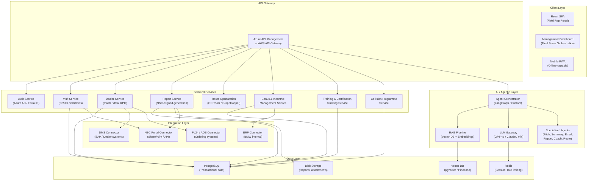
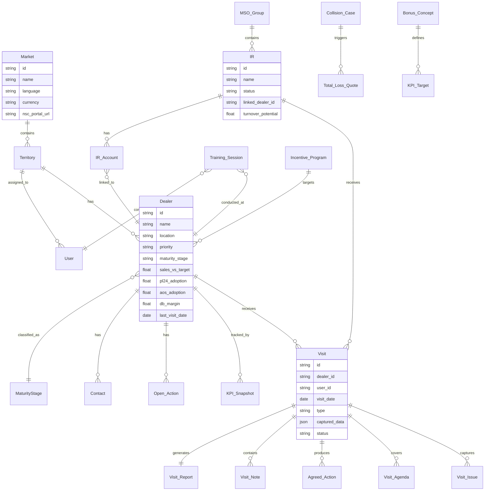
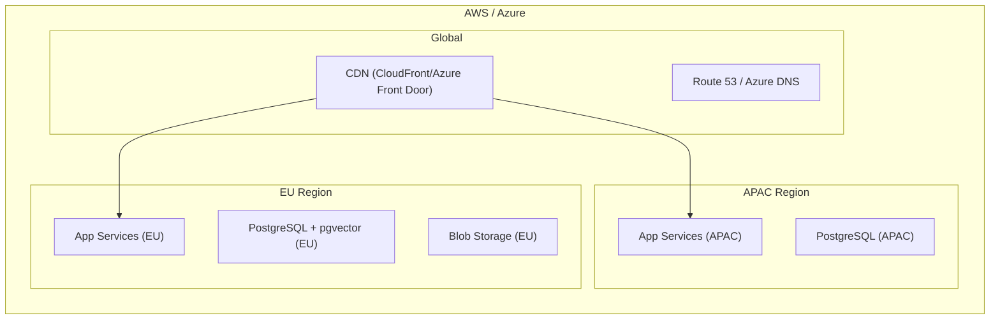

# Proposed Architecture: BMW Global IAM — Agentic Field Intelligence Platform

> Based on analysis of the BMW BWIR Tender Document (53 pages, 44 work packages), the Accenture Agentic Solution Proposal, and review of the existing POC application.

---

## 1. Executive Summary

The existing POC app correctly identifies the core value proposition: an AI-powered companion for IAM field executives to plan visits, capture data, and generate reports. The recent upgrade (June 2026) has addressed the most critical security and architectural gaps: the API key is now server-side only, a proper Express API backend proxies all AI calls, a centralized API client and data abstraction layer have been introduced, and auth has been moved to a backend endpoint.

This document proposes the remaining steps toward a **production-grade, multi-tenant, agentic architecture** aligned with both the BMW tender's 44 work packages and the Accenture proposal's 3-module vision (Agentic Sales Companion, Field Force Orchestration, Intelligent Route Planning).

---

## 2. Tender vs. Current POC — Coverage Analysis

The BMW tender defines **44 work packages** across the IAM lifecycle. Below is the coverage assessment:

| WP Range | Category | POC Coverage | Gap |
|----------|----------|-------------|-----|
| 1-12 | Market segmentation, analysis, reporting | ❌ None | Full build needed |
| 13 | Dealer report generation | ⚠️ Partial (AI summary only) | Structured NSC-aligned reports needed |
| 14 | Dealer assessment / Health Check | ⚠️ Partial (data display only) | On-site assessment workflow, scorecards |
| 15-16 | Dealer coaching (new, failed audit, individual) | ❌ None | Coaching plans, milestone tracking |
| 17 | Customer visit (IRs, Garage Chains) | ❌ None | IR visit workflow, training records |
| 18 | Customer assessment (IRs) | ❌ None | Turnover potential, health check for IRs |
| 19 | Bonus concept | ❌ None | Bonus framework design tool |
| 20 | Incentive management | ❌ None | Incentive planning, participant tracking |
| 21 | Online Sales Channel onboarding (AOS/PL24) | ⚠️ Mentioned in RAG | Onboarding workflow, account creation tracking |
| 22-23 | AOS & PL24 Training, Technical Support | ⚠️ Mentioned in RAG | Training management, certification tracking |
| 24 | IAM Marketing portal onboarding | ❌ None | Portal account creation workflow |
| 25 | Parts basket localization | ❌ None | Car park analysis, basket recommendation |
| 26-40 | Various operational tickets | ❌ None | Market-specific workflows |
| 41 | Proactive Total Loss Avoidance | ❌ None | Estimate analysis, quote generation |
| 42 | National Account Compliance (MSO) | ❌ None | MSO tracking, compliance monitoring |
| 43 | Programme Analysis | ❌ None | Report suite, NSC dashboards |
| 44 | Bodyshop & Paint Programme | ❌ None | Accreditation, audit, training tracking |

**Overall POC coverage: ~5-10% of the tender scope.** The POC focuses exclusively on work packages 13-18 (dealer visits and reporting), and even then, only partially.

---

## 3. Proposed Architecture

### 3.1 High-Level Architecture Diagram

### 3.2 Component Descriptions

#### 3.2.1 Client Layer

| Component | Technology | Purpose |
|-----------|-----------|---------|
| Field Rep Portal | React 18+ / Vite | Primary SPA for field executives (visit planning, capture, AI assistance) |
| Management Dashboard | React 18+ | NSC/management view: territory oversight, KPI tracking, FTE optimisation |
| Mobile PWA | Same codebase + service workers | Offline-capable version for on-site visits with poor connectivity |

**Decision**: Keep React + Vite + Tailwind (POC stack is solid for UI). Add PWA capabilities for offline use — critical because field reps visit dealers where network connectivity is unreliable.

#### 3.2.2 API Gateway

| Technology | Purpose |
|-----------|---------|
| Azure API Management or AWS API Gateway | Rate limiting, authentication, request routing, API versioning |

#### 3.2.3 Backend Services (Microservices or Modular Monolith)

Given the team size and timeline, a **modular monolith** (Node.js/Express or FastAPI/Python) is recommended initially, with clear domain boundaries that can be split later.

| Service | Responsibility | Key Endpoints |
|---------|---------------|---------------|
| **Auth Service** | SSO via Azure AD/Entra ID, role-based access (Field Rep, NSC Manager, Admin) | `/auth/login`, `/auth/token`, `/auth/me` |
| **Visit Service** | CRUD for visits, visit workflow state machine, action tracking | `/visits`, `/visits/:id`, `/visits/:id/actions` |
| **Dealer Service** | Dealer/IR master data, KPI aggregation, maturity scoring, territory assignment | `/dealers`, `/dealers/:id`, `/dealers/:id/kpis` |
| **Report Service** | NSC-aligned report generation (dealer reports, visit reports, programme analysis), template management | `/reports`, `/reports/generate`, `/reports/upload-nsc` |
| **Route Optimisation** | TSP/VRP solving for multi-stop visit planning, travel time estimation | `/routes/optimize`, `/routes/weekly-plan` |
| **Bonus & Incentive** | Bonus concept management, KPI target matrix, payout calculation | `/bonus`, `/bonus/concepts`, `/incentives` |
| **Training Service** | Training session management, certification tracking, gap analysis | `/training`, `/training/certifications` |
| **Collision Service** | Total loss avoidance programme, body shop accreditation, MSO compliance | `/collision`, `/collision/total-loss`, `/bodyshop` |

#### 3.2.4 AI / Agentic Layer

This is the **core differentiator**. The POC makes direct, unstructured API calls. The production system needs an agentic orchestration layer.

| Component | Technology | Purpose |
|-----------|-----------|---------|
| **Agent Orchestrator** | LangGraph, CrewAI, or custom state machine | Manages multi-step agent workflows (e.g., "Generate pre-visit brief" → fetch dealer data → run RAG query → call LLM → format output) |
| **RAG Pipeline** | pgvector / Pinecone + text-embedding-3-large | Chunks and embeds all BMW IAM documentation, tender docs, training materials, past visit notes |
| **LLM Gateway** | Custom router with fallback | Routes to appropriate model based on task complexity (Claude Sonnet for complex generation, GPT-4o-mini/Haiku for summarisation) |
| **Specialised Agents** | Prompt-engineered + tool-augmented LLM calls | Pitch Agent, Summary Agent, Email Agent, Report Agent, Coach Agent, Route Agent |

**Critical improvement over POC**: The POC's RAG is a 300-line hardcoded string. A real vector database with chunked, embedded documents enables:
- Semantic search across all BMW IAM documentation
- Context-aware retrieval based on dealer profile, KPIs, and visit history
- Retrieval of relevant past visit notes for continuity
- Dynamic updating as BMW documentation evolves

#### 3.2.5 Data Layer

| Component | Technology | Purpose |
|-----------|-----------|---------|
| **PostgreSQL** | AWS RDS / Azure PostgreSQL | All transactional data: dealers, visits, users, actions, KPIs, training records |
| **Vector DB** | pgvector (same Postgres instance) or Pinecone | Document embeddings for RAG |
| **Blob Storage** | Azure Blob / S3 | Generated reports (PDF), attachments, NSC uploads |
| **Redis** | AWS ElastiCache / Azure Cache | Session management, rate limiting, LLM response caching |

#### 3.2.6 Integration Layer

| Integration | Protocol | Purpose |
|------------|----------|---------|
| **NSC Portal / SharePoint** | REST API / Graph API | Upload visit reports, download dealer data, retrieve NSC KPIs |
| **DMS (Dealer Management System)** | REST/SOAP | Sync dealer master data, pricing, stock levels |
| **PL24 / AOS** | REST API | Order channel split data, adoption metrics, account status |
| **BMW ERP (SAP S/4HANA)** | OData / RFC | Sales data, turnover, rebate calculations |
| **CRM (Salesforce)** | REST API | Contact management, activity tracking |

**Note**: The Accenture proposal assumes API access to all these systems. The BMW tender does not guarantee this — these integrations must be confirmed during the Design & Discovery phase.

---

## 4. Data Model (Core Entities)

---

## 5. Security Architecture

| Concern | Solution |
|---------|----------|
| **API Key Exposure** | Move ALL API keys to server-side only. Use Azure Key Vault / AWS Secrets Manager. |
| **Authentication** | Azure AD / Entra ID SSO with JWT tokens. Role-based access control. |
| **Data Residency** | Multi-region deployment (EU, APAC, Americas) per BMW data sovereignty requirements. |
| **TISAX Compliance** | Required by BMW tender. Must achieve TISAX "Confidential" label. |
| **Encryption** | TLS 1.3 in transit, AES-256 at rest. |
| **Audit Logging** | All AI generations, report submissions, and data access logged for NSC audit. |

---

## 6. Deployment Architecture

**Decision**: Use **AWS** (as proposed by Accenture) or **Azure** (since the POC already uses Azure OpenAI). Multi-region deployment with data residency in each market's region.

---

## 7. Phased Rollout Plan

### Phase 1 — Foundation (✅ Complete — June 2026)
- [x] Proper backend with Node.js/Express API endpoints
- [x] Server-side AI calls (API key moved to `.env`)
- [x] Centralized API client (`src/services/api.js`)
- [x] Data abstraction layer (`src/data/dataService.js`)
- [x] Backend auth endpoint (`/api/auth/login`)
- [x] Vite dev proxy for seamless local development
- [ ] PostgreSQL database with migrated CSV data
- [ ] Azure AD / Entra ID authentication
- [ ] Real vector database RAG (replace hardcoded string)

### Phase 2 — Agentic Sales Companion (Months 3-6)
- [ ] Agent orchestrator for multi-step workflows
- [ ] Structured NSC-aligned report generation
- [ ] PWA with offline support
- [ ] Visit persistence and history
- [ ] IR data model and workflow
- [ ] Multi-market support framework

### Phase 3 — Field Force Orchestration (Months 6-9)
- [ ] Management dashboard with territory KPIs
- [ ] FTE optimisation analytics
- [ ] NSC portal integration (upload/download reports)
- [ ] Training & certification tracking
- [ ] Bonus & incentive management module

### Phase 4 — Intelligent Route Planning (Months 9-11)
- [ ] Route optimisation engine (TSP/VRP solver)
- [ ] Weekly/monthly visit plan auto-generation
- [ ] Travel time estimation with real traffic data

### Phase 5 — Advanced Modules (Months 11-18)
- [ ] Collision Programme (Total Loss Avoidance)
- [ ] National Account Compliance (MSO tracking)
- [ ] Bodyshop & Paint Programme
- [ ] Programme Analysis & NSC Reporting Suite
- [ ] Parts basket localization tool
- [ ] Additional market cluster rollouts

---

## 8. Technology Recommendations

| Area | Recommendation | Rationale |
|------|---------------|-----------|
| **Frontend** | Keep React + Vite + Tailwind | POC stack is solid. Add PWA. |
| **Backend** | Node.js (Express/Fastify) or Python (FastAPI) | Match team skills. FastAPI if heavy AI/ML integration needed. |
| **Database** | PostgreSQL + pgvector | Single DB for both transactional and vector data. Simplifies ops. |
| **LLM** | Hybrid: Claude Sonnet (complex) + GPT-4o-mini (simple) | As proposed by Accenture. Cost-optimised. |
| **Agent Framework** | LangGraph or custom state machine | Avoid over-engineering. Start simple. |
| **Cloud** | AWS (proposed) or Azure (existing) | Azure if continuing with OpenAI; AWS if broader ecosystem needed. |
| **CI/CD** | GitHub Actions | Standard, integrates with both AWS and Azure. |
| **Monitoring** | Datadog / Azure Monitor | APM, logging, LLM observability (token usage, latency, cost). |

---

## 9. Key Risks & Mitigations

| Risk | Impact | Mitigation |
|------|--------|------------|
| **BMW system APIs not available** | Cannot integrate NSC, DMS, PL24 | Confirm API access in Design phase. Build with mock interfaces. Have fallback manual upload. |
| **NSC report formats inconsistent across markets** | Field Force Orchestration extraction breaks | Build market-specific parsers. Confirm format consistency early. |
| **Data residency / TISAX compliance delays** | Cannot deploy in certain markets | Start with least regulated market. Engage BMW IT security early. |
| **Field rep tool adoption low** | Efficiency gains not realised | UX designed with field reps. Offline-first. Training & champion programme. |
| **LLM costs exceed budget** | Monthly platform cost balloons | Response caching, model tiering, token budgets per user/day. |

---

## 10. Verdict on Existing POC

### What to Keep
- React + Vite + Tailwind frontend stack (excellent choice)
- UI design patterns (dark theme, KPI pills, card layouts, step progress)
- CSV data loading pattern (useful for bulk imports later)
- Prompt engineering patterns for AI summary, pitch, and email generation
- RAG knowledge content (move to vector DB, but keep the content)
- Component decomposition (reusable ChipSelect, RadioGroup, QuestionGroup)

### What to Replace / Rebuild

| Item | Status |
|------|--------|
| **Server architecture**: Move from static file server to full API backend | ✅ Done — Express API with `/api/auth`, `/api/ai/chat`, `/api/ai/generate` |
| **Authentication**: Replace sessionStorage flag with backend auth endpoint | ✅ Done — `/api/auth/login` with demo token |
| **Data abstraction**: Single entry point for all data access, swappable to DB | ✅ Done — `src/data/dataService.js` |
| **API client**: Centralized HTTP client, no scattered fetch() calls | ✅ Done — `src/services/api.js` |
| **Secrets management**: Move API keys from source code to `.env` | ✅ Done — `.env` + `.env.example` + `.gitignore` |
| **Vite proxy**: Dev proxy from port 5173 → 8080 for seamless API calls | ✅ Done |
| **Data layer**: Replace CSV files with PostgreSQL | ⬜ Pending — dataService.js ready for DB swap |
| **Real RAG**: Replace hardcoded string with pgvector + chunking/embedding | ⬜ Pending |
| **Azure AD SSO**: Replace demo auth with Entra ID | ⬜ Pending |
| **PWA / offline support** | ⬜ Pending |
| **NSC integration** | ⬜ Pending |

### What the POC Gets Right
The POC correctly identifies that the core value of an AI-powered IAM tool is:
1. **Pre-visit intelligence** (what to focus on, what was discussed last time)
2. **In-visit assistance** (structured capture, real-time AI support)
3. **Post-visit automation** (report generation, follow-up emails, action tracking)

The problem is not the vision — it's the execution maturity. The POC is a great **UX prototype** and **stakeholder demo**. It is not production code.
